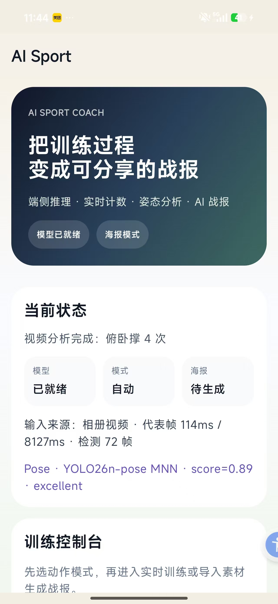
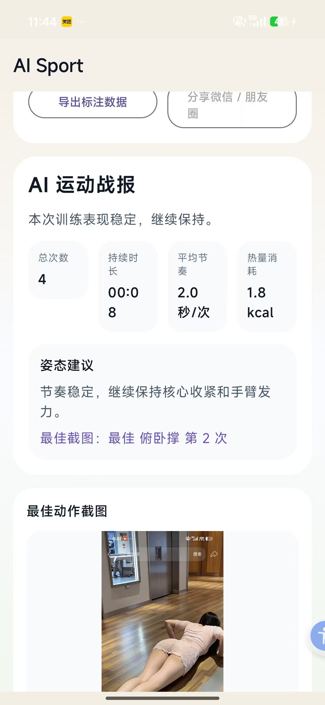
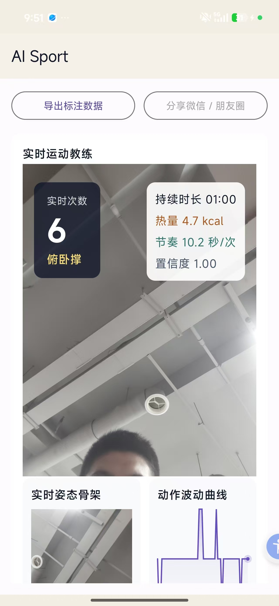
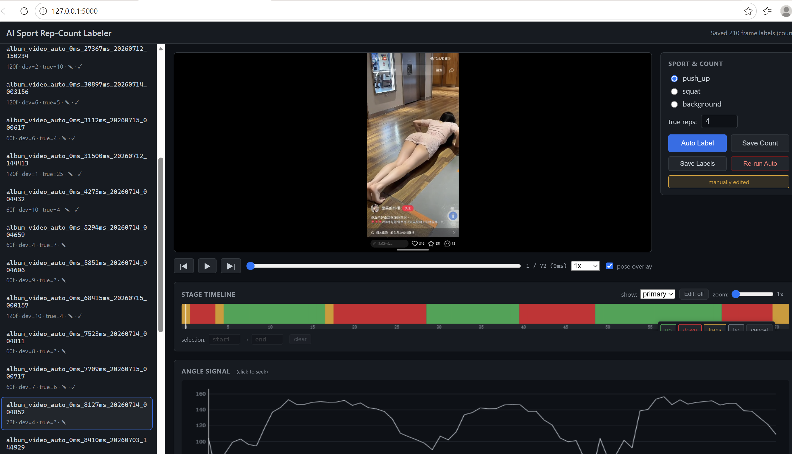

# AI Sport MVP

## Open Source

- GitHub: [https://github.com/laoyin/ai_sport](https://github.com/laoyin/ai_sport)

## APP 页面

  
  

  
  

当前版本是一个可落地的 Android AI 运动 MVP，支持：

- 选择运动图片
- 相机拍照输入
- 选择或录制运动视频
- 从视频中自动抽取关键帧
- 基于 `Qwen3-VL-MNN` 生成结构化运动点评
- 自动生成可保存到相册的运动宣传卡

## 当前实现

- Android 独立工程：`ai_sport/`
- MNN + Qwen3-VL JNI 接入
- 自动从工作区 `qwen3-vl-mnn/` 同步模型资源到打包目录
- 自动从 `MNN/MNN` 选择并同步 `libMNN.so / libMNN_Express.so / libllm.so`
- 相册选图
- 相机拍照输入
- 相册选视频 / 相机录制视频
- 视频关键帧自动选择
- `YOLO-Pose` 真实推理接入
- 关键帧骨架叠加到宣传卡
- 结构化 JSON 解析
- 海报 Canvas 合成
- 保存到系统相册

## 代码入口

- App UI: [MainActivity.kt](/D:/open-project/ali_ai_match/ai_sport/app/src/main/java/com/aisport/ui/MainActivity.kt)
- 视觉分析: [SportAnalyzer.kt](/D:/open-project/ali_ai_match/ai_sport/app/src/main/java/com/aisport/vision/SportAnalyzer.kt)
- Pose 接口: [PoseEstimator.kt](/D:/open-project/ali_ai_match/ai_sport/app/src/main/java/com/aisport/pose/PoseEstimator.kt)
- 视频抽帧: [VideoFrameSampler.kt](/D:/open-project/ali_ai_match/ai_sport/app/src/main/java/com/aisport/video/VideoFrameSampler.kt)
- 海报生成: [PosterComposer.kt](/D:/open-project/ali_ai_match/ai_sport/app/src/main/java/com/aisport/poster/PosterComposer.kt)
- JNI 推理: [mnn_jni.cpp](/D:/open-project/ali_ai_match/ai_sport/app/src/main/cpp/mnn_jni.cpp)
- Gradle 配置: [app/build.gradle.kts](/D:/open-project/ali_ai_match/ai_sport/app/build.gradle.kts)

## 说明

- 当前版本已经打通“相机 / 图片 / 视频输入 -> 关键帧 -> 运动分析 -> 出图”的闭环
- `YOLO-Pose` 已经实现：
  - 真实 `YOLO-Pose` 推理
  - 连续动作计数
  - 视频级训练战报生成

## 项目进展

- [x] 已实现数据标注
- [x] 已实现模型训练
- [x] 已实现 AI 自动计算 YOLO-Pose 关键帧信息
- [x] 已实现俯卧撑次数识别
- [x] 标注平台-模型训练
- [x] 已完成 20 个俯卧撑视频标注

## 下一步计划

- [ ] 完成 1000 个俯卧撑视频标注
- [ ] 升级 YOLO-Pose 模型
- [ ] 解决人体不完整、角度不好时的识别问题
- [ ] 为 YOLO-Pose 增加 Transformer，并重新标注和训练
- [ ] 在 7 月下旬推进深蹲次数识别
- [ ] 在 7 月下旬推进仰卧起坐次数识别

## 编译提示

- 当前目录没有单独提交 `gradlew` wrapper
- 建议直接使用 Android Studio 打开 `ai_sport/`
- 后续可以继续接入更强的 Pose 模型、关键帧选择逻辑和多动作扩展
